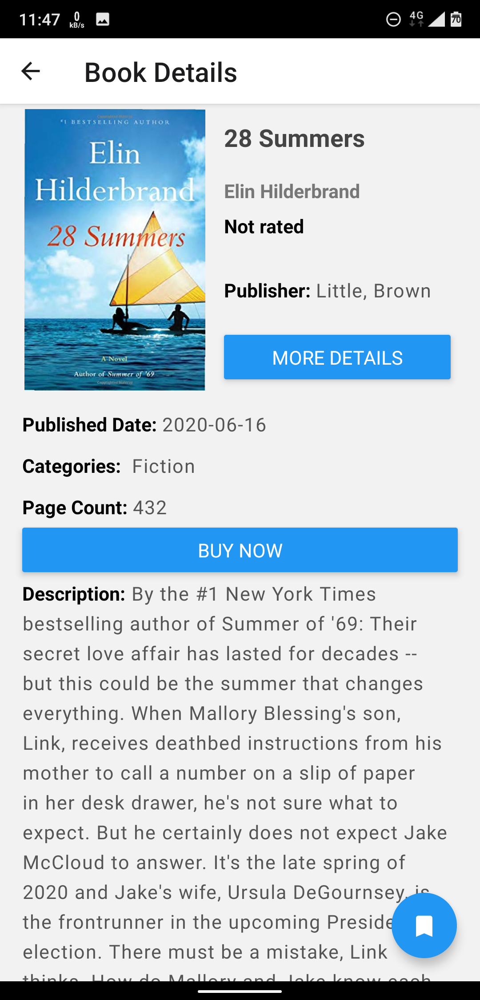
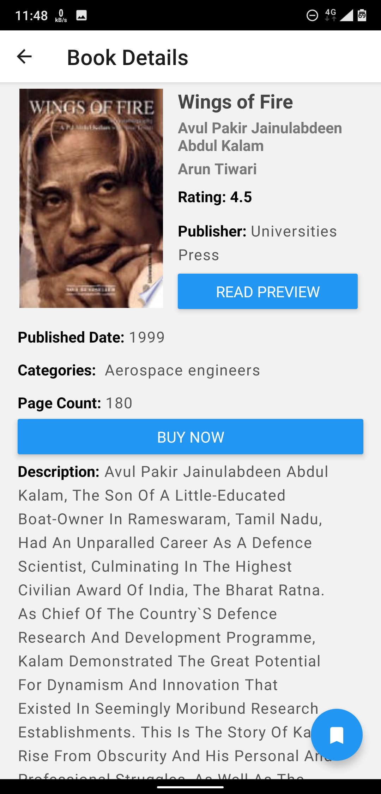
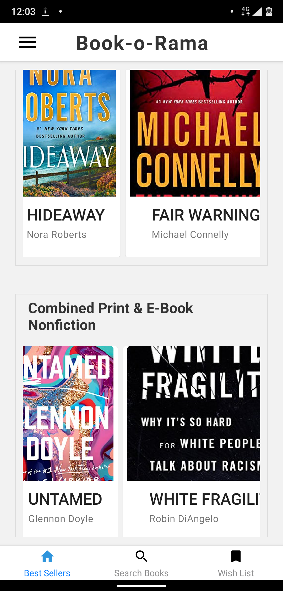

# Book-o-Rama

A Platform for readers everywhere to come and get to know the details about almost all books available on the internet.
- Built with React and React Native
- Web Version was also built simultaneously using the same codebase
- Uses the Google Books API for searching books -> Immense database of books availble
Features Include:
* Simple and clean UI with easy to navigate Tabs
* Features the NewYorkTimes bestseller list - updated every week
* FEature to search all kinds of books with Keywords, ISBN number
* Feature to search books based on authors
* Shows summary, and other details including rating of the book
* More details button takes the user directly to the Google books review section of the particular book
* Feature to save interesting books to a wishlist which persists even after closing the app and opening again (using asyncStorage)
* Buy Now option which directly takes the user to the particular Amazon page so that the user can read even further reviews of other buyers.
* Efficient on data and storage space by persisting the bestsellers list and updating only after every 7 days
* Separate page for receiving the valuable feedback from users so as to make improvements to the app if required

## Demo

